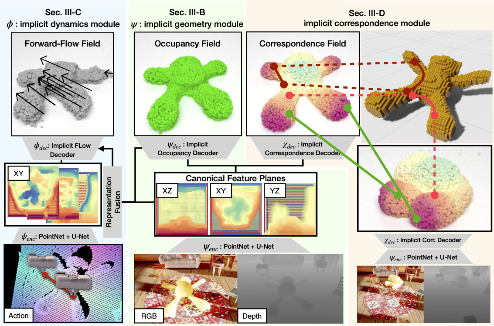

[](https://github.com/NVlabs/ACID/blob/master/LICENSE)


# ACID model 

<div style="text-align: center">

</div>

## Prerequisites 
We use anaconda to manage necessary packages. You can create an anaconda environment called `acid_train` using
```bash
conda env create -f environment.yaml
conda activate acid_train 
pip install torch-scatter==2.0.4 -f https://pytorch-geometric.com/whl/torch-1.4.0+cu101.html
```

Next, we need to compile extension modules used for mesh utilies, which are from [Convolutional Occupancy Network](https://github.com/autonomousvision/convolutional_occupancy_networks).
You can do this via
```
python setup.py build_ext --inplace
```

## Get Raw Manipulation Data
You can obtain our pre-generated manipulation trajectories from [PlushSim](../PlushSim/) from this [Google Drive](https://drive.google.com/drive/folders/1wOIk58e3wCfgOeYFBC1caYP2KAoFijbW?usp=sharing) directory. The manipulation trajectories are broken down to 10GB chunks. We recommend using [`gdown`](https://github.com/wkentaro/gdown) for downloading.

After downloading, please run the following commands to decompress the data:
```
cat data_plush.zip.part-* > data_plush.zip
unzip data_plush.zip
```

You should have the following folder structure:
```
ACID/
    data_plush/
        metadata/
            split1/
              ...
            split2/
              ...
            split3/
              ...
        split1/
            ...
        split2/
            ...
        split3/
            ...
```

### Generating Training Data 
To generate input-output pairs for ACID training, you need to run the following scripts to generate the data:
```
cd preprocess
python gen_data_flow_plush.py
python gen_data_flow_splits.py
python gen_data_contrastive_pairs_flow.py
```

This should create `train_data` directory inside this folder, with the following structure:
```
ACID/
    train_data/
        flow/
            split1/
            split2/
            split3/
            train.pkl
            test.pkl
        pair/
            split1/
            split2/
            split3/
```

If you wish to generate the data at another location, you can pass in different flags. Check out each preprocess script for details.

## Training
Finally, to train the ACID model from scratch, run:
```
python plush_train.py configs/plush_dyn_geodesics.yaml
```
For available training options, please take a look at `configs/default.yaml` and `configs/plush_dyn_geodesics.yaml`.

### Pretrained Weights
You can download pretrained weights on [Google Drive](https://drive.google.com/file/d/15ClJpMx8LlgPHXp1EeCP3Z4kD5h5bDKl/view?usp=sharing), please save `model_best.pt` to `result/geodesics/`.

## License
Please check the [LICENSE](../LICENSE) file. ACID may be used non-commercially, meaning for research or evaluation purposes only. For business inquiries, please contact researchinquiries@nvidia.com.

If you find our code or paper useful, please consider citing
```bibtex
@article{shen2022acid,
  title={ACID: Action-Conditional Implicit Visual Dynamics for Deformable Object Manipulation},
  author={Shen, Bokui and Jiang, Zhenyu and Choy, Christopher and J. Guibas, Leonidas and Savarese, Silvio and Anandkumar, Anima and Zhu, Yuke},
  journal={Robotics: Science and Systems (RSS)},
  year={2022}
}
```