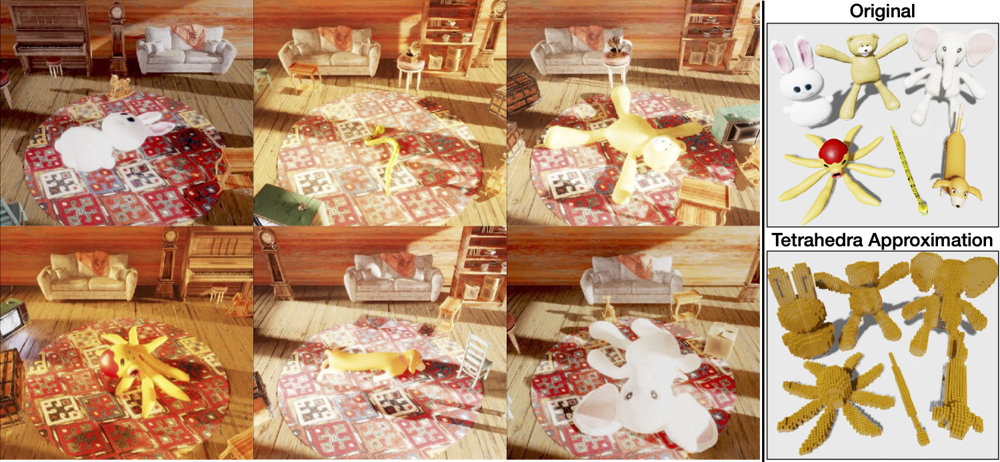

[](https://github.com/NVlabs/ACID/blob/master/LICENSE)


# PlushSim

<div style="text-align: center">

</div>

Our PlushSim simulation environment is based on [Omniverse Kit](https://docs.omniverse.nvidia.com/prod_kit/prod_kit.html). This codebase contains the docker image and the code to simulate and manipulate deformable objects. 

## Prerequisites 
Omniverse Kit has a set of hardware requirements. Specifically, it requires a RTX gpu (e.g. RTX 2080, RTX 30x0, Titan RTX etc.). Also, a 16GB+ memory is recommended.

The codebase is tested on Linux Ubuntu 20.04.  

## Getting the Docker Image
First, you need to install [Docker](https://docs.docker.com/engine/install/ubuntu/) and [NVIDIA Container Toolkit](https://github.com/NVIDIA/nvidia-docker) before proceeding.

After you have installed Docker and NVIDIA container toolkit, you can obtain the PlushSim Docker image from DockerHub, with command:
```
docker pull b0ku1/acid-docker:cleaned
```

## Preparing Simulation Assets 
You can download the simulation assets `raw_assets.zip` at: [Google Drive](https://drive.google.com/file/d/1OO8Wi0PHF3ROmW8088JNOMJn4EcDLDPB/view?usp=sharing). 

After you download it, unzip the assets within this directory. You should have a folder structure like:
```
PlushSim/
    assets/
        animals/
          ...
        attic_clean/
          ...
```

## Generating Manipulation Trajectories 
Generating manipulation data consists of two steps:
1. Start Docker image, and mount the correct directory.
2. Run script

To start the docker image with an interactive session, run the following command inside `PlushSim/`:
```
export PLUSHSIM_ROOT=$(pwd)
docker run -it -v $PLUSHSIM_ROOT:/result --gpus all b0ku1/acid-docker:cleaned bash
```

Aftery entering the interactive session, you can run the following commands to start generating manipulation trajectories:
```
./python.sh /result/scripts/data_gen_attic.py
```

The above scripts will generate sample interaction sequences in `PlushSim/interaction_sequence`. There are various command line arguments that you can give to `data_gen_attic.py`. Please see documentation of the python script.

## Visualizing the assets in GUI
To visualize the assets in Omniverse GUI, you need to download and install [Omniverse](https://docs.omniverse.nvidia.com/prod_install-guide/prod_install-guide.html). The link contains NVIDIA's official instruction for installation.

After you install Omniverse, you can open the `.usda` files in the assets folder. To run PlushSim's scripts outside of Docker (e.g. with your native Omniverse installation), you can find more information at [Omniverse Kit's Python Manual](https://docs.omniverse.nvidia.com/py/kit/index.html). For questions regarding Omniverse usage, please visit [NVIDIA developer forum](https://forums.developer.nvidia.com/c/omniverse/300).


## License
Please check the [LICENSE](../LICENSE) file. ACID may be used non-commercially, meaning for research or evaluation purposes only. For business inquiries, please contact researchinquiries@nvidia.com.

If you find our code or paper useful, please consider citing
```bibtex
@article{shen2022acid,
  title={ACID: Action-Conditional Implicit Visual Dynamics for Deformable Object Manipulation},
  author={Shen, Bokui and Jiang, Zhenyu and Choy, Christopher and J. Guibas, Leonidas and Savarese, Silvio and Anandkumar, Anima and Zhu, Yuke},
  journal={Robotics: Science and Systems (RSS)},
  year={2022}
}
```